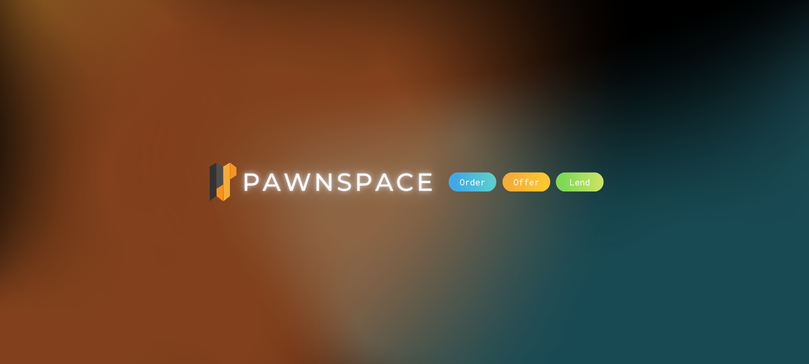

# Official PawnSpace Documentation

PawnSpace is a decentralized NFT collateralized lending platform, that allows you to convert your NFTs into financial opportunities. The protocol is currently being built on Polygon with the alpha now LIVE on Mumbai Testnet.
_**"Don't let your NFTs stay idle in your wallet anymore. Collateralize them, and turn your NFTs into financial opportunities! 'Cause, why not? :)"**
_

**Abstract**
The document introduces a decentralized NFT Collateralized Protocol that enables users to borrow and lend assets such as NFTs (ERC721 compliant). It also explores and describes the theory and technical aspects of the protocol / platform and its key features that make it distinct from existing products in the market.

> **`Authors: Robin Roy, Tomohira Futura, Julian Cislo`**

> **`Whitepaper Version 1.0 | August 2021`**
>
> **`Last Updated: 20th August, 2021`**

Website: https://pawnspace.io/. 
Twitter: https://twitter.com/pawnspace/
Discord: https://discord.gg/ahhKUvZwNx

