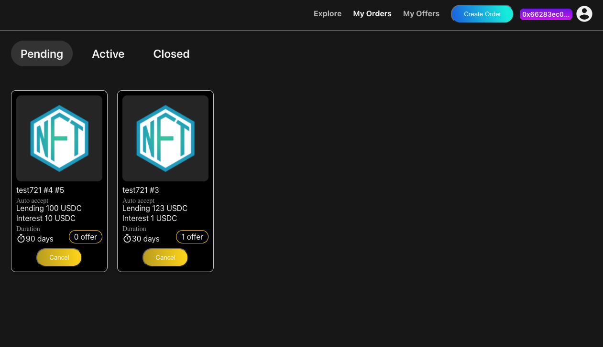
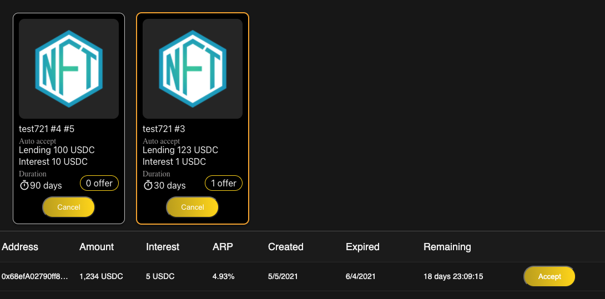
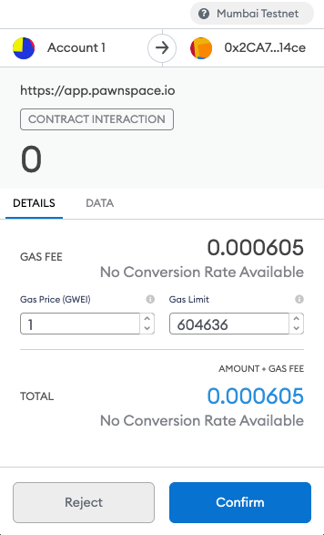

# Accept an offer \(borrower\)

Click the "My Orders" button on the header menu.

The orders you own are listed. You can delete an order by clicking the "Cancel" button. As you choose\(click\) an order, the offers that offered to the order shown.

If there is an offer you would like to accept, you can click the "Accept" button.  
The Metamask shows a dialogue. Click the "Confirm" button.

