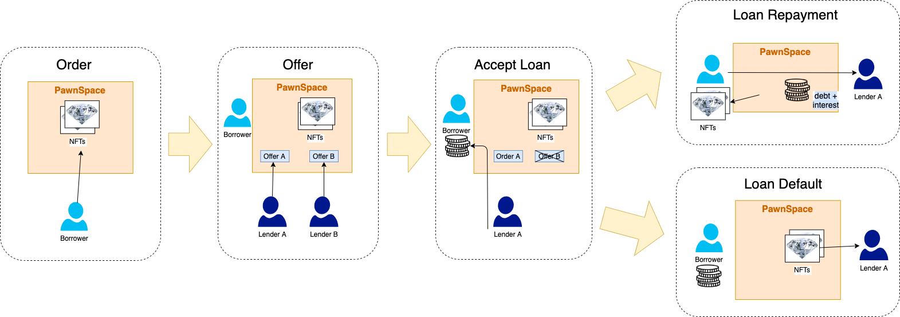

# Architecture

**The Pawn Space protocol begins with a factory contract which deploys a pawnspace for each existing NFT contract on the parent chain. A pawnspace consists of two smart contracts: one to house the order NFTs, and another to house the offer NFTs. The order smart contract contains functions for creating orders, modifying auto-accept parameters, accepting orders, paying back loans, and withdrawing an NFT from a defaulted loan. The Offer contract contains functions for creating offers towards an existing order, and auto-accepting loans. Cancelling/burning offers and orders that are in-active is also possible.**

