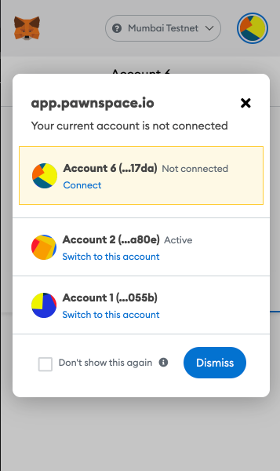

# Configure a wallet

### **GETTING STARTED** 

    This page guides the user in connecting Metamask to PawnSpace, and configuring their wallet to Mumbai Testnet.

Go to **[https://app.pawnspace.io](https://app.pawnspace.io)**

When you access PawnSpace, it offers to open MetaMask. Click the wallet account that you want to use.  

If you see the message "Change to Mumbai Testnet" on the top right of the page, please change the Metamask network to Mumbai Testnet. If you haven't configured your wallet to connect to Mumbai Testnet, follow this guide to do so: 
[https://docs.matic.network/docs/develop/metamask/config-matic/](https://docs.matic.network/docs/develop/metamask/config-matic/)

