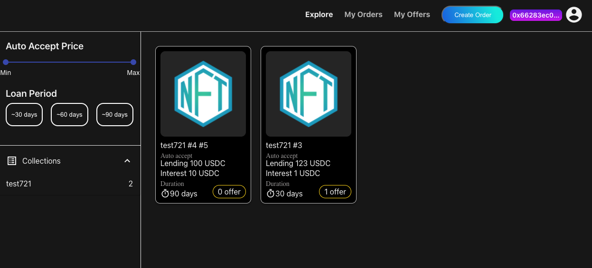
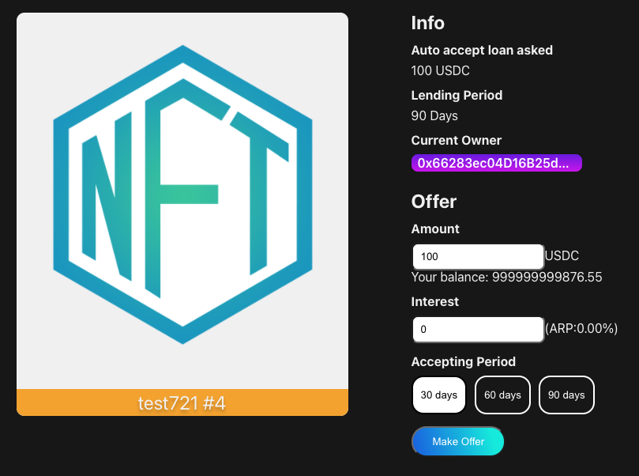
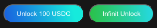
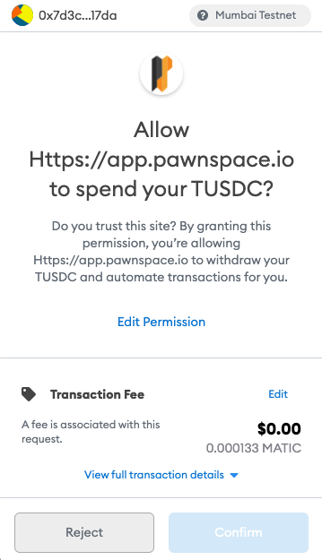

# Create an Offer \(Lender\)

    This page guides a user on how to Create an Offer on an Order.

- When you click  "Explore" on the header menu, this displays the existing Orders that are waiting for someone to lend funds to.

- Select an Order and check the details of the Order.

- Input the **"Amount"** and **"Interest"** that you want to lend, and choose the **duration of the loan**.

- Click on either **"Unlock xxx USDC"** (approves the usage of limited number of USDC to be managed by the contract. You will be required to approve transactions for subsequent loans - recommended) or **"Infinite Unlock"** (approves unlimited usage of USDC by the contract. You will not need to approve USDC in future loans). This will allow the transfer of your tokens if the Borrower accepts your Offer.

- The Metamask shows a dialogue to approve it. Click the **"Confirm"** button.

Click the **"Create"** button to submit your offer.

