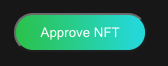

# Create an order \(borrower\)

Click the "Create Order" button on the header menu.

Your own NFT tokens are shown. Click collateral tokens you want \(You can choose several tokens\).

Click the "Select" button at the bottom of the page 

Input "Auto accept amount" and "Auto accept interest" which are the loan condition that you accept automatically if a lender offers it. If you do not want to set the condition, put "0" to both.

"Lending Period" is a term you want to borrow the debt. \[The time you accept lending + this period\] is the deadline you repay.

Click the "Approve NFT" button if the button is showing. You need to approve to operate the NFTs to the PawnSpace smart contract. 

The Metamask shows a dialogue to approve it. Click the "Confirm" button.

Click the "Create" button.

