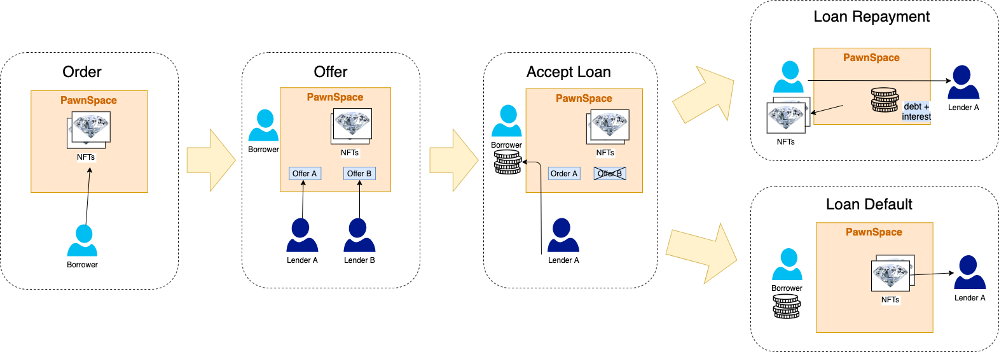

# Borrowing and Lending Flow

## **Borrowers collateralize NFT (Create Order)**    

The loan process consists of a multi-step procedure, beginning with the creation of a loan Order. A borrower who wants to take out a loan against their NFTs will first create a loan order and lock their NFTs within the PawnSpace contract. The user has the option to collateralize multiple NFTs within a single Order, provided they are issued from the same ERC721 contract. The borrower can then specify their preferred loan conditions for an Instant Loan and list it on the PawnSpace platform. 

## **Lenders Create Offers**

Once an order has been created, prospective lenders will be able to submit pending offers for the loan. Lenders in the market will scout the PawnSpace platform for Orders and either create Offers or accept the existing loan conditions for an Instant Loan. 

If the lender chooses to create an Offer, the lender will specify their preferred loan conditions (loan amount, suggested interest rate, and duration for the loan) based on what they think is the valuation of the NFT and the risk factor of the loan (optimal LTV).

## **Borrowers Accepts an Offer**

The borrower will then be able to view and accept an offer. Only one Offer can be accepted per Order. Upon accepting an order, the loan period initiates, and the borrower receives the loan principal \(minus platform fees\). The borrower has until the specified deadline to pay back the principal and interest. 

## **Repayment or Default of Loan**

Failure to pay off the loan in time results in the lender **having the ability to claim the collateral NFT(s)**. Upon expiration of the loan period, **the lender must initialize the `withdraw` process to CLAIM the collateral**. This means that **the borrower may pay their loan back after the expiration of the lending period to RECLAIM their NFT collateral, provided the lender has not yet withdrawn.**

