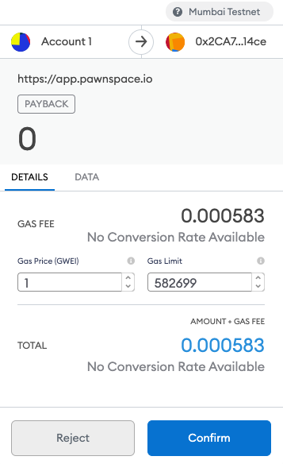
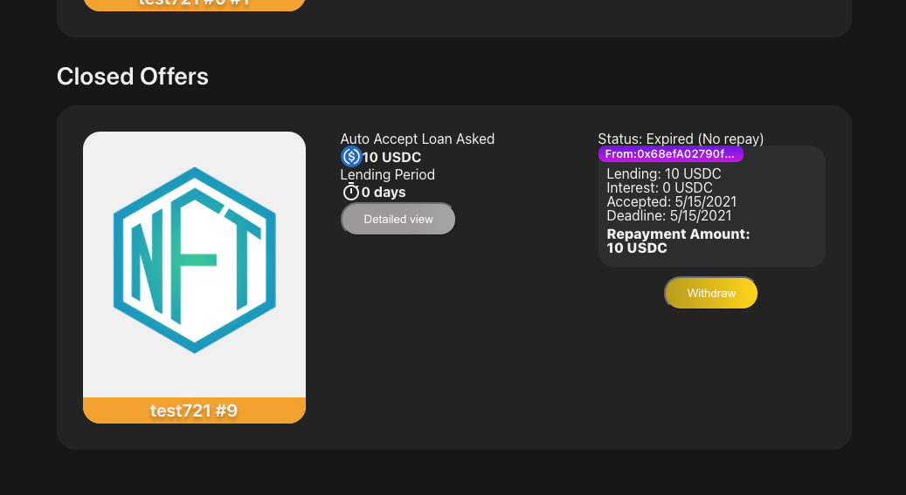
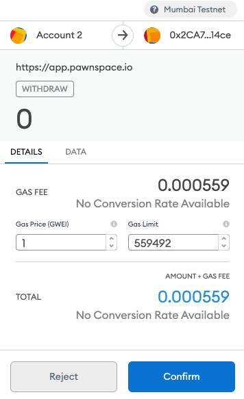

# Repay or Withdraw

## Repay \(for borrowers\)

You can pay back the debt within a limited time. By repayment, you can recover the NFT that was deposited as collateral.

Click the "My Orders" text on the header menu.

Click the "Repay" button which is in the order card that you want to pay back. If the "Approve" button shows the bottom of the order card, you have to click it and approve to operate the ERC20 tokens to the PawnSpace smart contract. 

The Metamask shows a dialogue. Click the "Confirm" button.

## Withdraw \(for lenders\)

If the repayment is not in time, the lender can withdraw the collateral NFT at any time

Click the "My Offers" text on the header menu.

Click the "Withdraw" button, and a Metamask dialogue shows. Click the "Confirm" button.

